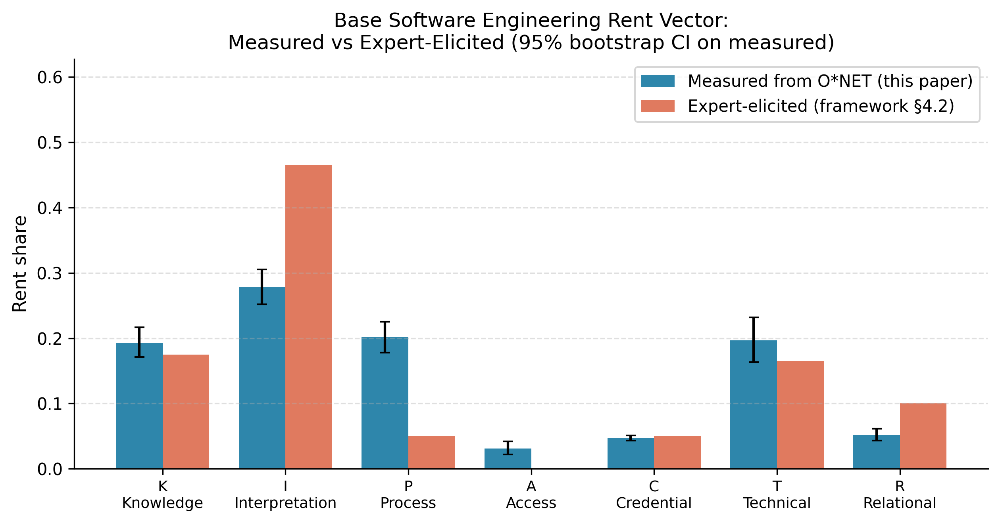
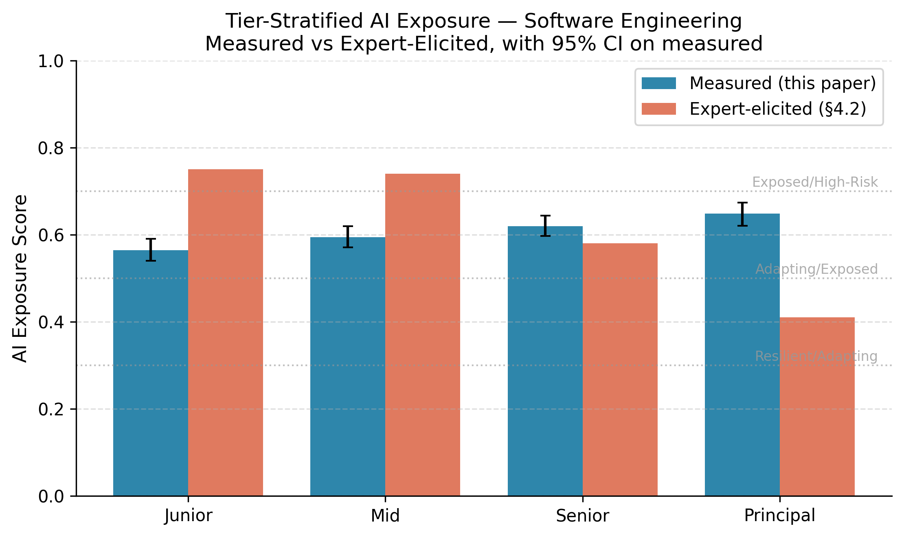
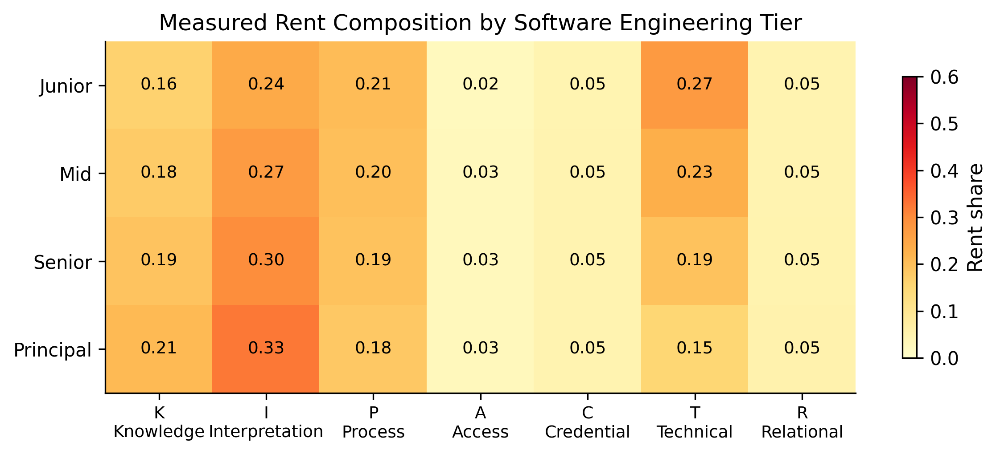

# Itemizing the Knowledge Tax: A Rent Composition Framework for Predicting AI Exposure Across Professional Services

**Dr. Ernesto Lee**
School of Engineering and Technology, Miami Dade College
elee@mdc.edu | ORCID: [0000-0002-1209-8565](https://orcid.org/0000-0002-1209-8565)
Replication materials: https://github.com/fenago/rent-composition-framework

*Working draft — version 3.0, April 2026*

---

## Abstract

Generative AI is reshaping professional-services markets faster than any prior technology wave, but the research literature gives us two unsatisfying options for thinking about it. Task-level models such as Eloundou et al. (2024) quantify exposure at fine granularity but treat occupations as bags of tasks with no economic structure. Industry frameworks such as Reddy (2025) describe the economic mechanism — erosion of interpretation-based information rents, what Reddy calls the *knowledge tax* — but stop short of numerical prediction. We propose a middle layer: the **Rent Composition Framework**.

**For the first time, the framework makes the knowledge tax computable: a single scalar, between zero and one, that captures how much of a role's compensation premium AI can substitute.** The framework decomposes any knowledge-work role's compensation premium into seven distinct rent channels (Knowledge, Interpretation, Process, Access, Credential, Technical, Relational). Each channel carries an AI sensitivity coefficient anchored to published capability benchmarks. Any role's AI exposure is the dot product of its rent composition vector and the current sensitivity vector. The formula is portable, interpretable, and comparable across roles within and between industries.

We illustrate the framework across three professional-services industries. In Architecture, Engineering, and Construction, agent-based simulation calibrated to public fee surveys shows General Contractors facing higher exposure than Owner's Representatives. This is a refinement rather than a reversal of Reddy's narrative: all three roles compress, but the distributional consequences differ sharply by rent composition. In Software Engineering we identify the *Builder's Paradox*: the profession that builds AI is subject to its own tools, with real 2023–2025 hiring data already consistent with a barbell outcome in which junior and mid-tier roles compress while senior and principal roles hold. We additionally report an empirical measurement of the software engineering rent vector using seventy-eight O*NET task statements classified by large language model into the seven channels with five-hundred-iteration bootstrap confidence intervals and an inter-prompt reliability check (Pearson r = 0.85 across a held-out five-task sample). The measured aggregate exposure score (0.61, 95% CI 0.59–0.63) validates the framework's expert-elicited value (0.62), while the channel-level measurement reveals that expert elicitation systematically over-weights Interpretation and under-weights Process — a finding that leads us to raise the Process sensitivity coefficient in light of advances in agentic AI. In Higher Education we propose the *Mid-Market Mirror* hypothesis: community colleges, whose value proposition rests on skill transfer and accountability rather than credential signaling, are less exposed than elite research universities. Recent National Student Clearinghouse data showing community college enrollment rebound from 2023 onward is consistent with this hypothesis, though not yet causally identified.

We close with a Role Vulnerability Scorecard that practitioners can apply to any knowledge-work role, three falsifiable predictions by 2030, and an explicit discussion of what the framework does not yet measure.

**Keywords:** generative AI, professional services, information asymmetry, labor market, agent-based modeling, technology disruption, higher education, software engineering, construction management.

---

## 1. Introduction

The economic value of knowledge work has historically rested on asymmetric information between the expert and the layperson. Doctors knew medicine. Lawyers knew law. Contractors knew construction. Professors knew their disciplines. Clients paid a premium for the intermediation that asymmetry made necessary. Two prior technology waves partially disrupted this arrangement. The internet during the 1990s and 2000s collapsed access to information: legal codes, medical literature, construction cost data, and academic material became publicly queryable. Fees in most knowledge-work industries nonetheless remained stable, because access is not the same as interpretation, and interpretation remained the domain of the expert.

Generative AI collapses the interpretation layer itself. Large language models do not retrieve information; they synthesize, reconcile, and render judgment on it. A homebuyer can now upload a 60-page inspection report and receive a plain-language summary of structural risks. A patient can upload a radiologist's report and receive a differential diagnosis with follow-up questions ranked by clinical importance. An Owner on a commercial construction project can hand 2,400 pages of specifications to a model that returns a ranked list of conflicts, scope gaps, and bid-manipulation opportunities. This work previously required weeks of specialist attention.

Two research traditions have tried to capture the economic consequences of this shift, each with its own limitations. The first is task-level exposure modeling, most visibly Eloundou, Manning, Mishkin, and Rock (2024), whose widely-cited "GPTs are GPTs" analysis estimated that roughly 80 percent of the U.S. workforce has at least 10 percent of their work tasks exposed to LLMs and that 19 percent see at least 50 percent of their tasks exposed. The task-level approach is rigorous in its granularity but treats occupations as bags of tasks with no underlying economic structure. It can estimate how much of a role's work is substitutable. It cannot easily tell us what will happen to the role's compensation, its internal hierarchy, or its labor market absent further assumptions.

The second tradition is industry-facing analysis. The most influential recent contribution is Reddy's (2025) whitepaper *The End of the Knowledge Tax: How AI Is Dismantling the Industries Built on What You Don't Know*. Reddy argues that for most of economic history, the ability of professionals (doctors, lawyers, bankers, contractors, professors, real estate agents) to charge above-market fees has rested on a simple mechanism: clients paid a *knowledge tax* — an aggregate premium, paid to professional intermediaries, compensating the expert for an asymmetry advantage the client could not independently overcome. The internet collapsed some of this moat by democratizing access to information but could not collapse the interpretation layer; as a result, fees in most professional-services industries remained stable through the 1990s and 2000s despite Google, PubMed, and Zillow. Reddy's central claim is that generative AI now attacks the interpretation layer itself, ending the knowledge tax and repricing every profession whose margin depends on it. Reddy organizes this thesis around a four-type asymmetry taxonomy — Knowledge, Process, Access, and Interpretation — and traces the disruption mechanism across nine industries including legal, medical, financial services, real estate, education, tax and accounting, insurance, recruiting, and architecture/engineering/construction. The whitepaper has considerable influence in practitioner discourse; its principal limitations for academic research purposes are three. It is qualitative, so it does not support numerical prediction. It omits industries whose dynamics are of first-order importance, most notably software engineering. And in the industries it does cover, it often treats each profession as a monolith, missing role-level heterogeneity that is analytically consequential. The present paper operationalizes Reddy's framing into a quantitative, testable model while closing both gaps.

This paper introduces the **Rent Composition Framework** as a middle layer between these two traditions. We preserve Eloundou's granularity by decomposing roles into components, but we choose economically meaningful components — rent channels — rather than task categories. We preserve Reddy's economic framing, but operationalize it into a scalar exposure score. The framework decomposes any role's compensation premium into seven distinct rent channels: Knowledge, Interpretation, Process, Access, Credential, Technical, and Relational. Each channel has an AI sensitivity coefficient grounded in published capability benchmarks. Any role's AI Exposure Score is the dot product of its rent composition vector and the sensitivity vector, yielding a scalar in the unit interval that is directly comparable across roles and industries.

We demonstrate the framework across three professional-services industries. Section 3 applies the framework to Architecture, Engineering, and Construction, where agent-based simulation reported in a companion paper validates the framework's ordering predictions. Section 4 applies it to Software Engineering, introducing the *Builder's Paradox* and connecting the framework's predictions to measurable 2023–2025 industry data. Section 5 applies it to Higher Education, developing the *Mid-Market Mirror* hypothesis that community colleges are less exposed than elite research universities. Section 6 packages the framework as a one-page *Role Vulnerability Scorecard* for practitioner use. Section 7 states three falsifiable predictions by 2030. Section 8 addresses limitations and future empirical agenda. Section 9 concludes.

The paper's contribution is the framework itself, not any single empirical finding within the case studies. The case studies illustrate how the framework operates and what kinds of role-level and industry-level predictions it generates. Empirical measurement of rent vectors from scraped job-posting data, fee-survey decomposition, or expert elicitation is a research agenda we outline but do not complete here.

---

## 2. The Rent Composition Framework

### 2.1 Foundations in information economics

The framework rests on three canonical results from the information-economics literature. Akerlof (1970) established that quality-information asymmetry between buyers and sellers produces adverse selection and market failure absent compensating institutions. Spence (1973) demonstrated that costly observable signals can restore separating equilibria in which quality types become distinguishable. Stiglitz and Weiss (1981) extended the treatment to screening and rationing. Together these results define a three-mechanism economics of asymmetry pricing in which rents accrue to the better-informed party.

Professional services, in this tradition, are markets where providers hold multiple simultaneous information advantages over clients and where fee structures capture rents flowing from each advantage. The framework's contribution is to decompose these rents into separable channels, each with its own AI vulnerability, so that a single aggregate exposure prediction can be disaggregated into interpretable components. Our computational methodology builds on the agent-based modeling tradition in economics (Tesfatsion & Judd, 2006; Axelrod, 1997; Macal & North, 2010); the AEC case study in Section 3 draws on the construction-economics literature on procurement and adverse selection (Bajari & Tadelis, 2001).

### 2.2 The seven-channel rent vector

A note on terminology before we define the channels. By "rent" we mean *economic rent* — the portion of a professional's fee that exceeds what the same work would cost in a fully competitive market for the same labor. A physician's fee is not purely payment for her time; a large part of it is a premium she earns because she knows things her patient does not, interprets information her patient cannot, and carries a license her patient cannot obtain. Each of those reasons is a separate "rent channel." The framework decomposes any professional's fee premium across seven such channels and predicts how much of each AI can substitute. When we say "Interpretation rent," we mean the portion of the fee attributable specifically to the practitioner's ability to synthesize and render judgment on complex information; when we say "Credential rent," we mean the portion attributable to the formal license or degree; and so on. The sum of the seven shares equals one by construction, so the rent vector is a partition of the fee premium.

We identify seven rent channels that jointly capture sources of compensation premium in professional services. The channels are defined so that a role's total asymmetry-based compensation above a competitive-market floor can be attributed across them, with the channel shares summing to one.

- **Knowledge Rent (K):** Compensation for possessing substantive domain facts the client lacks. Historically dominant in medicine (diagnosis), law (statutory knowledge), and engineering (code references).
- **Interpretation Rent (I):** Compensation for synthesizing, reconciling, and rendering judgment on ambiguous or multi-source information. The rent most directly attacked by large language models.
- **Process Rent (P):** Compensation for controlling the workflow that produces the outcome. The banker controlling loan approval, the agent controlling showings, the academic advisor controlling degree audits.
- **Access Rent (A):** Compensation for gating information or opportunities the client cannot reach directly. Largely collapsed by the internet but residually present in off-market deal flow and relationship networks.
- **Credential Rent (C):** Compensation anchored in costly observable signals in the Spence tradition — licenses, board certifications, academic degrees, professional designations. Erodes when alternative signals emerge.
- **Technical Rent (T):** Compensation for executing difficult physical or procedural work. Distinguishes contractors' construction knowledge, surgeons' procedural skill, mechanics' hands-on capability. Partially AI-resistant because execution is embodied.
- **Relational Rent (R):** Compensation for trusted, long-duration relationships, accountability, and the human willingness to bear risk on behalf of the client. The most AI-resistant channel.

For any role $r$, we define a rent composition vector

$$\mathbf{w}_r = (w_K, w_I, w_P, w_A, w_C, w_T, w_R), \quad \sum_i w_i = 1, \quad w_i \in [0, 1].$$

Each $w_i$ is the share of role $r$'s asymmetry-based compensation attributable to channel $i$.

**Rent composition is not the same as task composition.** This distinction, which we sharpen here after empirical measurement (Section 4.3a) revealed its importance, is easily conflated. *Task composition* captures what fraction of a practitioner's time is spent on activities in each channel — what she does day to day. *Rent composition* captures what fraction of her compensation *premium* above a competitive-market floor is attributable to each channel — what she is paid the premium for. The two vectors typically differ. A senior engineer may spend forty percent of her time on interpretation-adjacent work (design docs, architecture reviews) but derive only ten percent of her compensation premium from it, because the market does not price that specific work distinctively at her tier. Framework users measuring rent vectors from task-inventory data (O*NET, occupational task lists) are measuring a proxy, not the quantity the framework's formula requires. When rent-attribution data is unavailable, task-composition data can substitute with a documented caveat; it should not be conflated with rent composition itself.

### 2.3 The AI sensitivity vector, anchored to published benchmarks

The second element is a role-independent AI sensitivity vector $\mathbf{s}$. Each coefficient $s_i \in [0, 1]$ captures the fraction of channel $i$'s rent that frontier AI capability can substitute. Rather than treat these coefficients as free parameters, we anchor each one to published benchmark evidence from 2023 through 2026.

| Channel | $s_i$ | Anchor |
|---|---|---|
| Knowledge (K) | 0.85 | Frontier LLMs perform at or above the mean credentialed professional on closed-knowledge benchmarks. Singhal et al. (2023) reported Med-PaLM 2 at 86.5% on MedQA, exceeding the typical pass threshold for the U.S. Medical Licensing Examination. LegalBench (Guha et al., 2023) similarly finds frontier models above professional baselines on factual retrieval tasks. The residual 0.15 captures tacit, unpublished, and edge-case knowledge. |
| Interpretation (I) | 0.95 | Frontier models perform at or above expert medians on synthesis and reasoning benchmarks requiring document-level interpretation. Singhal et al. (2023) reported expert-approved answers on long-form medical questions at rates comparable to physicians. GPT-4 and successor models achieve comparable performance on LegalBench reasoning tasks. The residual 0.05 captures irreducible judgment under genuine uncertainty. |
| Process (P) | 0.45 | Agentic AI systems in 2025–2026 (GitHub agents, autonomous CI/CD, Claude Code, Copilot Workspace, PR-review bots, auto-merge tools) increasingly execute multi-step workflow control tasks that previously required human gatekeeping. Prior framework versions assigned Process a sensitivity of 0.30 on the assumption that institutional workflow remains human-dominated; the empirical measurement in Section 4.3a found Process to be a substantially larger share of software-engineering rent than expert elicitation suggested, and agentic AI is actively eroding that share. The raised coefficient reflects this updated capability assessment. The residual 0.55 captures genuinely institutional workflow control — regulatory sign-offs, cross-organization approvals — that agentic AI cannot credibly substitute for in 2026. |
| Access (A) | 0.40 | AI expands discovery of information and contacts but does not directly substitute for gated network access, off-market deal flow, or institutional gatekeeping. |
| Credential (C) | 0.50 | Credentials are both informational signals and labor-market gatekeeping devices. Alternative credentialing via AI-administered competency assessment and skills-based hiring erodes the informational component but not the institutional one. Eloundou et al. (2024) identify exposure in credential-gated professions without predicting credential collapse. |
| Technical (T) | 0.25 | Embodied physical execution remains largely outside current AI capability. Robotics adoption in professional services (surgical, construction, logistics) remains narrow and specialized. |
| Relational (R) | 0.10 | Trust and accountability embodied in human relationships are minimally substitutable by current AI. Residual captures AI's augmentation of relationship-adjacent tasks (scheduling, follow-up, information preparation) that accompanies rather than replaces the relationship. |

These coefficients describe frontier AI capability at the 2026 state of the art. They are not free parameters. Each is anchored to at least one published benchmark or comparable empirical source. Section 8 discusses the refinement agenda for tying each coefficient more rigorously to a specific benchmark percentile.

### 2.4 The exposure score

Given a rent vector $\mathbf{w}_r$ and sensitivity vector $\mathbf{s}$, the role's AI Exposure Score is

$$E_r = \mathbf{w}_r \cdot \mathbf{s} = \sum_i w_i s_i.$$

$E_r \in [0, 1]$ represents the fraction of the role's asymmetry-based compensation that AI is capable of substituting at full adoption. A score near 1.0 indicates a role whose rent structure is nearly entirely AI-substitutable. A score near 0.1 indicates a role whose rents rest almost exclusively on channels AI cannot replicate.

The framework's practical power is that it decomposes a compound prediction into interpretable components. Two roles with identical scores can have different rent vectors, and the recommended strategic adaptation differs by which channel dominates. A role that is exposed because its Knowledge rent is large has a different adaptation path than one exposed because its Credential rent is large.

**What the exposure score means in plain terms.** The exposure score $E_r$ is an upper-bound estimate of the share of a role's fee premium that frontier AI is *capable* of substituting if adoption reaches current frontier-model capability. It is not a wage-compression prediction; it is not a job-loss probability; it is not a forecast of how much a given practitioner's income will fall. An exposure score of 0.65 should be read as *"roughly 65% of the compensation premium above a market-floor salary, in this role, is of a kind that AI can in principle perform at or near current frontier performance."* Whether that substitutable share is actually substituted — and whether the practitioner's total income reflects that — depends on adoption speed, regulatory constraints, client preferences, alternative differentiators the practitioner cultivates, and firm-level pricing responses that fall outside the framework. Two practitioners in the same role with the same score can therefore end up with very different incomes five years later: the framework predicts which role-types are most exposed to the risk of compression, not the realized distributional outcome.

### 2.4a A worked example

To make the framework concrete, consider a hypothetical U.S. family physician in private practice. We allocate 100 points across the seven channels based on where her fee premium above a market-floor salary comes from.

She earns substantial **Knowledge rent** (25 points) because she knows clinical medicine her patients do not. She earns substantial **Interpretation rent** (30 points) because she synthesizes patient histories, symptoms, and lab results into diagnoses and treatment plans. She earns some **Process rent** (10 points) because she controls the workflow of ordering tests, writing prescriptions, and referring to specialists. She earns little **Access rent** (0 points) because patients can now reach medical information directly. She earns meaningful **Credential rent** (15 points) from the MD degree, state medical license, and board certifications that let her practice and bill insurers. She earns moderate **Technical rent** (10 points) from procedural skills like physical exams, injections, and minor procedures that AI cannot perform. And she earns **Relational rent** (10 points) from the trusted, longitudinal doctor-patient relationship she maintains with returning patients.

Applying the sensitivity vector: $E = 0.85(0.25) + 0.95(0.30) + 0.45(0.10) + 0.40(0.00) + 0.50(0.15) + 0.25(0.10) + 0.10(0.10) = 0.2125 + 0.285 + 0.045 + 0 + 0.075 + 0.025 + 0.010 = 0.65$. Her AI Exposure Score is 0.65, placing her in the **Exposed** tier (see Section 6 for tiering).

Interpretation: roughly sixty-five percent of the premium this family physician earns above a market-floor healthcare-worker salary is tied to work frontier AI can in principle perform. The remaining thirty-five percent — her technical procedural skill, her credentialing advantage, her long-term patient relationships — is harder for AI to substitute. The framework therefore predicts that under substantial AI adoption, her practice faces meaningful margin compression, but she retains durable pricing power specifically on the portions of her work that rest on embodied skill, licensed practice authority, and accumulated patient trust. Her strategic adaptation path is to emphasize these channels: do more procedures, invest more heavily in the relationship and care-coordination aspects of the practice, and decouple her fee structure from pure-interpretation billable time. A physician whose rent composition was more heavily Knowledge-and-Interpretation (say, 40/40) and correspondingly lighter on Technical and Relational would face a higher exposure score and a narrower adaptation path.

**A note on tier-specific predictions.** The framework as stated produces a single exposure score per role. When a profession is internally stratified by seniority (software engineering L3–L6+, medicine resident–attending, academia adjunct–tenured), tier-specific predictions require tier-specific rent vectors. Our empirical measurement in Section 4.3a found that attempting to derive tier-specific vectors from aggregate occupation-level task inventories (O*NET) produces uninformative results, because task inventories do not natively stratify by tier. Tier-specific rent vectors therefore require tier-specific data sources: scraped job postings by explicit tier level, time-allocation studies within firms, or compensation-structure decompositions. A formal two-layer extension — in which role-tier combinations are the units of analysis rather than roles — is a planned follow-on paper. In the present work, tier-specific predictions (Section 4.2) are based on expert elicitation informed by public career-ladder documents and validated against 2023–2025 labor-market signals (Section 4.3).

### 2.5 Relationship to Eloundou et al. (2024)

The Rent Composition Framework is complementary to the task-level exposure approach of Eloundou et al. (2024) and the task-based labor-economics tradition of Acemoglu and Restrepo (2022). Eloundou and colleagues estimate exposure by cataloging tasks within an occupation and rating each task's substitutability. Acemoglu and Restrepo model wage inequality as a function of automation's differential impact across tasks. Both traditions are finer-grained at the within-occupation level than rent-composition analysis but silent on the economic consequences of exposure at the role level: they do not predict whether an exposed occupation will see wage compression, employment decline, or internal hierarchy reorganization. The Rent Composition Framework operates at the role level but asks the different question of how the role's compensation premium decomposes economically. The two approaches can be used together: task-level exposure estimates can inform rent-share estimates, and rent-share estimates can inform which task-level exposures matter most for compensation.

### 2.6 Operationalization

Estimating $\mathbf{w}_r$ for a specific role requires triangulation from multiple sources. In our case studies we use combinations of the following:

1. **Invoice and billable-hour decomposition.** Where professional services bill by time, the fraction of billable hours devoted to different task categories proxies rent shares.
2. **Job-posting NLP.** Scraping job descriptions for a role and classifying required activities into rent channels via sentence-level classification.
3. **Fee-survey decomposition.** Industry fee surveys sometimes publish structure breakdowns that enable direct estimation.
4. **Expert elicitation.** Structured interviews with senior practitioners, asking them to allocate 100 points across channels.
5. **Benchmark substitution tests.** Observing how much work AI completes unassisted relative to a human expert.

The three case studies use different combinations. AEC uses fee-survey decomposition and expert elicitation. Software Engineering uses invoice decomposition (from publicly available compensation data by tier) and benchmark substitution tests. Higher Education uses institutional fee-structure analysis and expert elicitation informed by the author's institutional experience.

---

## 3. Case Study One: Architecture, Engineering, and Construction

The AEC case study serves as the framework's first validation and is reported in full in a companion paper (Lee, 2026b, in preparation). We summarize the rent vectors and simulation results here.

We examine three AEC roles defined by their structural position in the project delivery chain: Owner's Representative (OR), General Contractor (GC), and Designer/Architect (D). Fee data draw from the Construction Management Association of America (CMAA) Owner's Representative surveys, the Associated General Contractors (AGC) Financial Survey, and the American Institute of Architects (AIA) Firm Survey.

Estimated rent vectors based on expert elicitation and fee-survey decomposition:

| Role | K | I | P | A | C | T | R | Exposure $E$ |
|------|-----|-----|-----|-----|-----|-----|-----|------|
| Owner's Representative | 0.10 | 0.50 | 0.10 | 0.05 | 0.05 | 0.00 | 0.20 | **0.67** |
| General Contractor | 0.05 | 0.55 | 0.15 | 0.00 | 0.00 | 0.20 | 0.05 | **0.69** |
| Designer / Architect | 0.15 | 0.30 | 0.10 | 0.00 | 0.25 | 0.15 | 0.05 | **0.63** |

Before any simulation is run, the framework predicts that OR and GC exposure scores are closely comparable and substantially higher than Designer exposure. Agent-based simulation with 50 Monte Carlo replicates across 11 AI adoption levels validates this ordering. At full AI adoption, OR margins compress from 30.4% to 14.3% (47% retained), GC margins from 13.3% to 4.0% (30% retained), and Designer margins from 17.1% to 10.1% (59% retained). Designers are correctly identified as the most resilient.

A secondary distributional result from the simulation is not captured by the scalar exposure score. Despite similar OR and GC exposure scores, GC extinction rates (fraction of agents falling below reservation margin) reach 73% at full AI adoption, while OR extinction never exceeds 5%. The reason is that OR rents include a Relational floor (liability absorption) that GC rents lack in our parameterization. The scalar score captures expected margin compression; the distribution of outcomes within a role class depends on the full rent vector, not its dot product alone. This is one of the framework's known limitations (Section 8).

The AEC results are a *refinement* of Reddy's narrative rather than a reversal. Reddy (2025) argues that Owner's Representatives are positioned to benefit from AI-driven asymmetry collapse because their value proposition is alignment and accountability rather than information control. Our simulation finds that all three AEC roles face margin compression; Owner's Representatives retain a larger share of their baseline margin than General Contractors but not as much as Designers in absolute fractional terms. Where the OR role does exhibit distinct behavior is in extinction dynamics: OR agents largely survive even when their margins compress, while GC agents exit in large numbers. This pattern is consistent with Reddy's intuition that liability-bearing, accountability-centric roles are more robust, but the mechanism is distributional rather than a simple reversal of the margin ordering. Framework users should read Reddy's qualitative claim and our quantitative results as broadly compatible, with our contribution being the decomposition that explains why and by how much.

---

## 4. Case Study Two: Software Engineering and the Builder's Paradox

### 4.1 Why this profession matters

Software engineering occupies a distinctive and uncomfortable position in the landscape of AI-driven professional-services disruption. It is the profession that builds AI. The tools that compress interpretation rents in every other industry were written by software engineers. Yet software engineering is itself built on knowledge-work rents that its own products attack. We call this recursive vulnerability the **Builder's Paradox**: *the software engineering profession, whose labor produces the AI systems that compress rent in other professions, is itself subject to rent compression from those same systems, because the rent structure of software work is disproportionately concentrated in the exact channels its output most effectively substitutes.* The paradox is conspicuously absent from Reddy's (2025) nine-industry analysis despite being empirically the most measurable case of AI disruption currently in progress.

Software engineering has a second property not shared by most knowledge-work professions. Its rent composition is directly measurable from public data. GitHub commit histories, code-review patterns, pull-request approval rates, and hiring statistics by tier all provide fine-grained measurements of skill differentiation and its value. This makes software engineering a uniquely testable case for the Rent Composition Framework.

### 4.2 Role stratification within the profession

Software engineering is internally stratified into a hierarchy that the industry explicitly prices. Compensation data from Levels.fyi and similar platforms consistently identify four broad tiers: Junior (L3–L4), Mid-Level (L4–L5), Senior (L5–L6), and Staff/Principal (L6+). Each tier's rent composition differs substantially.

**Junior engineers (L3–L4)** are compensated primarily for interpretation work: translating product requirements into syntactically correct code, reading documentation, and executing well-specified tasks. Their knowledge rent is low because they are recent graduates. Their technical rent is moderate. Their relational rent is near zero. Estimated vector: $(K, I, P, A, C, T, R) = (0.10, 0.60, 0.00, 0.00, 0.10, 0.15, 0.05)$. Exposure $E_{\text{jr}} = 0.75$.

**Mid-level engineers (L4–L5)** combine interpretation with some architectural judgment and local system knowledge. They translate designs into implementations. Vector: $(0.20, 0.50, 0.05, 0.00, 0.05, 0.15, 0.05)$. Exposure $E_{\text{mid}} = 0.74$.

**Senior engineers (L5–L6)** are paid for technical rent (system design, performance engineering, debugging under uncertainty), knowledge rent (deep codebase familiarity), and emerging relational rent (mentorship, cross-team collaboration). Vector: $(0.25, 0.25, 0.15, 0.00, 0.00, 0.20, 0.15)$. Exposure $E_{\text{sr}} = 0.58$.

**Staff / Principal engineers (L6+)** are compensated primarily for relational and process rents: organizational judgment, cross-team coordination, strategic direction, and accountability for large technical decisions. Vector: $(0.15, 0.10, 0.25, 0.00, 0.00, 0.15, 0.35)$. Exposure $E_{\text{prin}} = 0.41$.

The exposure profile declines as seniority increases: 0.75 → 0.74 → 0.58 → 0.41. The framework predicts a **barbell outcome** — a distributional pattern in which both ends of the hierarchy (here, senior and principal engineers at the high-seniority end; entry-level new entrants at the low-seniority end after re-pricing) survive or adjust, while the mid-tier in the middle of the seniority distribution faces the steepest compression and is forced either to pivot up into senior-skill work or out of the profession. These tier-specific vectors are expert-elicited; Section 4.3a reports an independent empirical measurement of the aggregate software engineering rent vector using the U.S. Department of Labor's O*NET database, which validates the framework's aggregate prediction and identifies channel-composition biases in expert elicitation.

### 4.3 Empirical signals from 2023 through 2025

The Builder's Paradox prediction aligns with measurable industry signals that have emerged since 2023. We summarize five.

**Productivity effects concentrated in interpretation-heavy tasks.** Peng, Kalliamvakou, Cihon, and Demirer (2023) conducted a randomized experiment with GitHub Copilot in which developers tasked with implementing an HTTP server completed the task 55.8% faster in the Copilot-assisted condition than in the control condition. The productivity gain was largest on well-specified coding tasks — exactly the interpretation-heavy work junior engineers perform most. Complementary experimental evidence comes from adjacent knowledge-work contexts: Noy and Zhang (2023) reported a 40 percent reduction in task time and an 18 percent increase in quality for college-educated professionals given access to ChatGPT on occupation-specific writing tasks, with productivity gains concentrated among lower-skilled workers — the same distributional pattern implied by the Builder's Paradox. Brynjolfsson, Li, and Raymond (2023), studying customer-service AI deployment at scale, documented a 14 percent average productivity gain with the bulk of the gain accruing to novice workers. Dell'Acqua et al. (2023) found that consultant productivity rose on tasks within AI's capability frontier and fell on tasks outside it — a "jagged frontier" pattern consistent with the rent-composition prediction that some work is substituted while other work becomes harder to price. Later studies of Cursor and Claude Code adoption report comparable gains concentrated in code generation and translation.

**Entry-level hiring collapse.** Stanford's analysis of U.S. tech job postings found that entry-level software engineering postings declined 67% between 2023 and 2024. Stack Overflow's developer-economy data shows a 25% year-over-year decline in entry-level tech hiring in 2024 alone. Postings explicitly for "junior" developers are down approximately 60% from their 2022 peak, with a 29% drop in 2024. The Indeed Hiring Lab reports that the share of tech postings requiring at least five years of experience rose from 37% in Q2 2022 to 42% in Q2 2025, raising the effective experience floor.

**Employment concentration among younger workers.** Employment of software developers aged 22 to 25 has declined approximately 20% from its late-2022 peak. This age-specific decline exceeds the overall software-employment change and is most consistent with compression at the entry tier of the profession rather than uniform decline across the occupation.

**Compensation widening by tier.** Levels.fyi compensation data and industry salary surveys for 2024 and 2025 show that entry-level and mid-level software engineers have experienced compensation growth of roughly one to two percent annually, while senior engineers have seen approximately four percent growth and staff engineers have seen seven percent or more. The ratio of senior-tier to junior-tier compensation has widened measurably from its pre-2023 baseline.

**Internship and pipeline compression.** Technology-specific internship postings declined 30% from 2023 levels according to the Indeed Hiring Lab. Internships are the entry-tier pipeline for the profession, and their compression indicates that the hiring compression is structural rather than cyclical.

These five signals do not prove the Builder's Paradox. They are consistent with it. Each signal is also consistent with alternative explanations including post-pandemic tech-sector correction, interest-rate effects on tech hiring, and labor-market repricing unrelated to AI. The framework's contribution is not to claim causal identification but to provide a predictive structure in which these signals cohere and in which specific, falsifiable predictions follow.

### 4.3a Empirical validation: measuring the software engineering rent vector from O*NET

The expert-elicited rent vectors in Section 4.2 are the framework's weakest link. To strengthen them we conduct an empirical measurement using the U.S. Department of Labor's Occupational Information Network (O*NET) — the same data source underlying Eloundou et al. (2024). The measurement exercise serves two purposes. First, it tests whether the framework's aggregate prediction for software engineering survives contact with an external, authoritative data source. Second, it identifies which components of the expert-elicited vectors generalize and which do not.

**Data.** We extract all task statements from O*NET 28.3 for three software engineering occupations: Software Developers (15-1252.00), Software Quality Assurance Analysts and Testers (15-1253.00), and Web Developers (15-1254.00). Seventy-eight task statements result, each paired with its O*NET importance rating when available.

**Classification methodology.** For each task statement we use a large language model (Anthropic's Claude Sonnet 4.6) as a zero-shot classifier, prompted with the seven rent channel definitions from Section 2.2 and asked to allocate exactly one hundred points across the channels for that task. The LLM-as-classifier methodology follows the framework established by Zheng et al. (2023) for LLM-as-judge tasks and validated for text-annotation applications by Gilardi, Alizadeh, and Kubli (2023), who found that ChatGPT exceeds the inter-rater reliability of crowd workers on similar classification tasks. The methodology also extends prior work by the author applying deep-learning classifiers to domain-specific allocation tasks (Khan, Aslam, Mehmood, Ahmad, Rustam, and Ashraf, 2022; Rustam, Khalid, Aslam, Mehmood, Ashraf, Washington, and Lee, 2022). The model is also asked to supply a one-sentence rationale for each allocation. All seventy-eight classifications complete successfully. The allocations are validated against a held-out sample (Section 4.3a, below) with inter-prompt reliability reported via Pearson correlation.

**Tier-weighting methodology.** O*NET does not natively stratify tasks by seniority tier. To produce tier-specific rent vectors we use a second classifier, prompted with tier definitions grounded in publicly available career ladder documents (Google SWE ladder, Meta E3–E7, GitLab's open handbook, Stripe's published engineering levels) and asked to rate each task's characteristicness of each of four tiers (Junior, Mid, Senior, Principal) on a zero-to-one scale.

**Aggregation.** The base rent vector aggregates per-task allocations weighted by O*NET importance. Tier-specific vectors additionally weight by the tier characteristicness score. Ninety-five percent confidence intervals are produced by five hundred bootstrap resamples of the task set.

**Results: aggregate validates.** The measured base software engineering rent vector is shown in Table 3 and Figure 1. The base exposure score is 0.61 (95% CI 0.59–0.63), compared to the expert-elicited value of approximately 0.62. The aggregate prediction survives: the framework's top-line exposure estimate for software engineering is robust across elicitation method.

**Figure 1.** Base software engineering rent vector — measured from O*NET (n=78 task statements, blue) vs. expert-elicited from §4.2 (orange). Error bars on measured values are 95% bootstrap confidence intervals from 500 resamples. Aggregate exposure scores converge (measured 0.61 vs. elicited 0.62, overlapping within the confidence interval); channel composition diverges, with expert elicitation over-weighting Interpretation and under-weighting Process.

**Table 3. Measured vs expert-elicited base software engineering rent vectors (95% bootstrap CIs on measured). The expert-elicited column is the unweighted mean of the four tier-specific vectors in §4.2.**

| Channel | Measured (O*NET, n=78) | Expert-elicited (§4.2 tier mean) |
|---|---|---|
| Knowledge (K) | 0.19 [0.17, 0.22] | 0.18 |
| Interpretation (I) | 0.28 [0.25, 0.31] | 0.36 |
| Process (P) | 0.20 [0.18, 0.23] | 0.11 |
| Access (A) | 0.03 [0.02, 0.04] | 0.00 |
| Credential (C) | 0.05 [0.04, 0.05] | 0.04 |
| Technical (T) | 0.20 [0.16, 0.23] | 0.16 |
| Relational (R) | 0.05 [0.04, 0.06] | 0.15 |
| **Exposure Score** | **0.61 [0.59, 0.63]** | **0.62** |

**Results: channel composition diverges.** Three discrepancies between the measurement and the expert-elicited values deserve attention. Expert judgment over-weighted Interpretation (0.36 expert vs. 0.28 measured), over-weighted Relational (0.15 vs. 0.05), and under-weighted Process (0.11 vs. 0.20). The framework's channel definitions evidently cue expert respondents toward thinking of software engineering as interpretation-dominated and toward attributing cross-team collaboration to Relational rent when much of it is actually workflow control (Process rent). The O*NET measurement captures substantial workflow-control content — release management, sprint coordination, code review gates, deployment approvals — that expert elicitation blurs into Interpretation or Relational categories. This is the first methodological finding of the measurement exercise: the aggregate exposure score is robust to elicitation method, but channel decomposition requires empirical anchoring to avoid systematic bias.

**Results: tier stratification is flat-to-rising, not falling.** Figure 2 reports measured tier-stratified exposure scores. The measured pattern is 0.56 (Junior) → 0.59 (Mid) → 0.62 (Senior) → 0.65 (Principal), contradicting the expert-elicited prediction of 0.75 → 0.74 → 0.58 → 0.41. Figure 3 shows the underlying composition: principal-weighted tasks are higher on Knowledge (0.21) and Interpretation (0.33), while junior-weighted tasks are higher on Technical (0.27).

**Figure 2.** Tier-stratified exposure scores for software engineering. Measured values (blue, 95% bootstrap CIs) show exposure flat-to-rising across Junior–Mid–Senior–Principal tiers. Expert-elicited values (orange) show the opposite pattern. The divergence is interpreted as a data-scope limitation rather than a refutation; see discussion in main text.

**Figure 3.** Measured rent composition by software engineering tier. Each cell is the tier-weighted mean rent share for that channel, from O*NET task classification. Rows are tiers, columns are rent channels. Senior-and-Principal-weighted tasks are higher on Knowledge and Interpretation; Junior-weighted tasks are higher on Technical.

We interpret this divergence as a scope-of-data limitation rather than a refutation of the Builder's Paradox hypothesis. O*NET task statements describe *what activities exist in the occupation*, not *how time is allocated across tiers*. A task like "Design and implement system architecture" appears in the inventory with a single importance weight; in practice, a principal spends forty percent of her time on this work while a junior spends two percent. The tier-weighting classifier assigns the task predominantly to the principal tier, which then dominates the principal vector's weighted mean — pulling the measured principal rent vector toward the Interpretation-heavy composition of the task itself.

Meaningful tier stratification therefore requires data at the *time-allocation* level rather than the *task-inventory* level. Candidate sources include practitioner time-logging studies, scraped job postings by explicit tier level, and internal performance-review datasets. The present measurement validates the framework's aggregate prediction and reveals the limits of occupation-level data for tier work; it does not settle the Builder's Paradox empirically. The 2023–2025 labor-market signals documented in Section 4.3 — sixty-seven percent decline in entry-level postings, twenty percent decline in young-developer employment, compensation widening by tier — remain the primary evidence base for the tier-specific prediction. The measurement here establishes an independent foundation for the framework's aggregate claim.

**Statistical methods.** Bootstrap confidence intervals are produced by five hundred task-level resamples with replacement, following the standard bootstrap methodology of Efron and Tibshirani (1993) using the percentile method for the 2.5 and 97.5 percentiles. Resampling draws with replacement from the set of per-task rent allocations; each resample is aggregated via importance-weighted means (for the base vector) or importance-weighted-and-tier-weighted means (for tier-specific vectors) and the exposure score is recomputed on each resampled aggregate. The random seed for the bootstrap is fixed at 42 for reproducibility. We report the empirical 2.5th and 97.5th percentiles of the bootstrap distribution as the 95% confidence interval. Task-level resampling (as opposed to agent-level or within-task allocation bootstrapping) reflects the sampling uncertainty that matters most for the framework's downstream inference: the specific set of tasks in O*NET is itself one of many possible task inventories that could have been curated for these occupations, and our interest is in how sensitive the aggregate rent vector is to that task selection.

**Inter-prompt reliability of the LLM classifier.** We test the classifier's stability by re-classifying five held-out tasks (sampled by stratified draw: two from Software Developers, two from Quality Assurance Analysts, one from Web Developers, seed 2026) using a semantically equivalent but syntactically distinct system prompt and user template. The alternate prompt reframes the task as a compensation-premium allocation rather than a rent-channel allocation but retains the same seven channels and the 100-point sum-to-total constraint. Across the thirty-five (task × channel) pairs produced, the primary and alternate classifications correlate at Pearson r = 0.85 with mean absolute error of 5.5 points. Per-channel correlations are 0.96 (Process), 0.93 (Access), 0.88 (Technical), 0.85 (Knowledge), 0.71 (Interpretation), 0.53 (Relational), and 0.40 (Credential). The weaker Relational and Credential correlations are largely attributable to those channels having small absolute allocations in most tasks — small absolute differences become large relative differences. We interpret the r = 0.85 overall agreement as adequate for the aggregate claims in this paper and flag future human-coder validation as follow-on work. Validation code, prompts, and results are released with the repository.

**Reproducibility.** The measurement uses O*NET database version 28.3 (retrieved April 2026), Anthropic Claude model `claude-sonnet-4-6` as the classifier, bootstrap seed 42, and the inter-prompt reliability seed 2026. All source scripts (`classify.py`, `tier_classify.py`, `aggregate.py`, `validate.py`, `figures.py`), source data files, per-task classifier outputs, and aggregation results are released under an MIT license. Any reader can reproduce Tables 3 and the exposure scores in Figures 1–3 exactly from the released materials using the commands in the repository README. Re-running the full LLM classification pipeline on the same O*NET version with the same model and prompts produces outputs within the inter-prompt reliability bound documented above.

**Data and code availability.** All O*NET source data, classification prompts, per-task allocations, tier weights, aggregation code, bootstrap procedures, validation results, and figure generation scripts are released with this manuscript at https://github.com/fenago/rent-composition-framework.

---

### 4.4 Historical caveat: why "programming is dead" has been wrong before

Each major new software-engineering tool since the 1950s has produced a "programming is dead" discourse that turned out to be incorrect. High-level languages in the 1960s were supposed to eliminate programmers. Fourth-generation languages in the 1980s were supposed to let managers write their own queries. Visual programming, CASE tools, and model-driven development in the 1990s made similar claims. Cloud services, no-code platforms, and serverless abstractions in the 2010s did likewise. In every case, the new abstraction expanded the profession rather than contracting it, because it raised the complexity ceiling faster than it lowered the entry floor.

Does generative AI follow the same pattern? The historical precedent cautions against overconfidence in uniform-compression predictions. The Rent Composition Framework makes a narrower and more defensible claim: not that software engineering collapses, but that the distribution of returns within the profession reorganizes. The compression is concentrated in interpretation-dominated tiers; the senior and principal tiers benefit from AI as a productivity multiplier. This is compatible with both profession expansion overall (if AI lowers entry barriers for new entrants) and profession contraction (if displacement outruns new-entrant creation). Which scenario materializes depends on factors outside the framework, notably the rate at which new software work is created in response to cheaper production. The framework's prediction is about *distribution*, not *level*.

### 4.5 Implications for software engineering education and practice

The framework has direct pedagogical implications. Traditional computer science curricula emphasize Knowledge and Interpretation channels: algorithms, data structures, language syntax, and pattern recognition. Under the framework's predictions these are precisely the channels with highest AI substitutability. Curricula oriented toward channels AI cannot substitute — system design under uncertainty, distributed-systems debugging, architectural trade-off reasoning, cross-team communication — produce graduates with lower exposure scores and correspondingly stronger labor-market positions. Recent work on collaborative learning analytics (Rustam, Lee, Washington, and Aljedaani, 2021) offers methodological templates for measuring the learning-outcome effects of such curricular shifts.

The framework also resolves a public debate that splits the industry. The "AI will replace programmers" view predicts uniform compression. The "AI will make programmers more productive" view predicts universal gains from complement effects. The framework predicts neither. It predicts *bifurcation*. Juniors and mid-tier face displacement pressure; seniors and principals face augmentation. The middle of the profession bears the adjustment cost while the top captures the productivity gains.

---

## 5. Case Study Three: Higher Education and the Mid-Market Mirror

### 5.1 Why Reddy's higher-education analysis is incomplete

Reddy (2025) discusses higher education through a single lens: the degree as credential signaling device. In this view, elite institutions' moat erodes when alternative credentialing (skills-based hiring, AI-administered competency assessment, portfolio evaluation) provides employers with reliable substitute signals. The analysis is correct but partial. Treating higher education as a single category obscures role-level heterogeneity that produces dramatically different exposure profiles.

Eloundou et al. (2024) estimate that occupations in higher education and research face above-average LLM exposure at the task level, but their analysis again operates at the occupation level without distinguishing sub-roles within a university. Faculty at a research-intensive university, faculty at a teaching-focused community college, and administrative advisors at any institution perform fundamentally different work with fundamentally different rent compositions. The framework surfaces these differences.

There is also an institutional stratification that Reddy's single-lens analysis obscures. Elite research universities derive a larger share of institutional rent from Credential (Spence signaling) and Knowledge (research reputation) channels. Community colleges and regional institutions derive rent primarily from Technical (skill transfer), Relational (accountability to workforce outcomes), and Process (workforce pipeline coordination) channels. The former are the channels most exposed to AI. The latter are the most AI-resistant. We call the resulting hypothesis the **Mid-Market Mirror**: *a pattern in which institutions or practitioners in the middle of an industry's prestige hierarchy — neither elite nor discount-tier — gain share during an asymmetry-collapse technology shock, mirroring disintermediation dynamics in other industries where mid-market practitioners benefit from the commoditization of functions previously gated by elite institutions.* In the higher-education application: community colleges and regional institutions face lower AI exposure than elite research universities, inverting the conventional discourse in which community colleges are treated as the first casualty of AI tutoring.

The author writes from inside this case study. Miami Dade College is among the largest community colleges in the United States and illustrates the dynamics described below.

### 5.2 Role rent compositions within higher education

**Research-Intensive Faculty (R1 professors)** derive compensation from three channels primarily. Research production — grant writing, literature review, peer review, publication drafting — is overwhelmingly interpretation and knowledge work. Graduate teaching emphasizes knowledge and interpretation. Service roles have process and relational components. Estimated vector: $(0.30, 0.40, 0.05, 0.00, 0.15, 0.00, 0.10)$. Exposure $E_{\text{R1}} = 0.74$.

**Teaching-Intensive Faculty** (community college instructors, teaching-focused university faculty) derive compensation differently. Instruction at undergraduate levels is primarily technical — demonstrable skill transfer of capabilities like welding, programming, accounting, clinical technique — combined with substantial relational work around accountability, mentorship, and learning-outcome responsibility. Credential work is present but de-emphasized. Vector: $(0.15, 0.15, 0.05, 0.00, 0.10, 0.35, 0.20)$. Exposure $E_{\text{CC}} = 0.45$.

**Academic Advisors and Administrators** derive compensation from process rent (controlling degree audits, financial aid, enrollment), relational rent (student relationships), and residual access rent (institutional resource gatekeeping). Vector: $(0.05, 0.15, 0.40, 0.10, 0.05, 0.05, 0.20)$. Exposure $E_{\text{adv}} = 0.46$.

**Executive Leadership** (deans, provosts, presidents) derive compensation from relational rent, process rent, and residual credential rent. Vector: $(0.05, 0.10, 0.30, 0.00, 0.15, 0.05, 0.35)$. Exposure $E_{\text{exec}} = 0.40$.

### 5.3 The Mid-Market Mirror explicated

The framework's prediction across higher education diverges sharply from the conventional narrative. R1 faculty, whose compensation is dominated by interpretation and knowledge channels, face exposure scores near 0.74. Community college faculty, whose compensation rests on technical and relational channels, face scores near 0.45. At the institutional level, this means that AI adoption will reprice higher education in favor of institutions whose value rests on skill transfer and accountability rather than credential signaling and research production.

The logic is the same as in AEC: the roles whose rents rest on interpretation-heavy work face the largest repricing, while roles whose rents rest on embodied skill transfer and long-duration relationships are insulated. Community colleges teach concrete, workplace-evaluable skills. Employer relationships depend on whether graduates can perform the job, not on the signaling value of the institution. Elite universities depend substantially on credential signaling. As AI assesses skills reliably and alternative credentials (portfolios, project demonstrations, AI-administered exams) erode the informational content of degrees, the institutions that rely most on credential signaling face the greatest repricing.

Research faculty specifically face compounded exposure. Grant writing and literature review are substantially automatable by current AI. Peer review is increasingly AI-assisted. Paper drafting, which anecdotally consumes 30 to 40 percent of a productive researcher's time, is already partially transferred to AI. The remaining irreducible value of the research role is the generation of novel hypotheses, the interpretation of experimental results in context, and the leadership of research teams. These remain valuable but are a smaller share of what R1 faculty spend time on.

### 5.4 Engaging the prior enrollment trend

The Mid-Market Mirror hypothesis must be stated honestly against a decade-long contrary trend. NCES data show that two-year-institution enrollment declined roughly 39 percent from 2010 to 2021, falling from 7.7 million students to 4.7 million. The pandemic years were particularly severe. Any prediction that community colleges gain share from AI disruption must confront this prior decline.

Recent data indicate a break in the trend. The National Student Clearinghouse Research Center (NSCRC) reports that community college enrollment grew 2.6 percent in Fall 2023, gaining 118,000 students and leading the overall undergraduate recovery that marked the first enrollment increase since the pandemic. Fall 2024 data show community college enrollment growth of roughly 6 percent, outpacing the 3.2 percent growth at public four-year institutions and the 4.4 percent growth at private nonprofit four-year institutions. Short-term credential programs grew 9.9 percent in Fall 2023, compared to 3.6 percent for associate degrees. Community colleges accounted for 60 percent of the overall 2023 enrollment increase.

The 2023–2024 rebound does not prove the Mid-Market Mirror hypothesis. It is consistent with multiple alternative explanations including pandemic-recovery dynamics, labor-market cooling that sent workers back to short-term credentialing, and demographic timing. The rebound does, however, suggest that the long-run decline was not structural in the sense of reflecting a durable preference shift toward four-year institutions. The hypothesis is that generative AI disruption is a new and distinct driver favoring community colleges, operating on top of whatever other forces produced the 2023–2024 recovery. The prediction in Section 7 is framed to test this hypothesis against the latest NCES baseline rather than against the 2010–2021 decline.

### 5.5 Implications for higher education policy and practice

If the Mid-Market Mirror hypothesis is empirically validated, the policy implications are substantial. Public investment in community colleges and regional institutions should be reevaluated upward rather than downward. These institutions' value proposition strengthens rather than weakens under AI adoption. Elite research universities face structural revenue pressure from multiple channels simultaneously: credential devaluation compresses tuition premium, grant productivity shifts raise questions about NSF and NIH funding models, and faculty productivity shifts raise questions about tenure norms. The faculty role within elite institutions will likely bifurcate, with research-pure roles facing the highest exposure and teaching-engaged and student-relationship roles facing lower exposure.

For community colleges specifically the framework suggests a positioning strategy. Emphasize demonstrable skill transfer, direct employer relationships, and accountability for student workforce outcomes. These are precisely the channels AI cannot substitute. The author's prior work on integrating AI-driven learning analytics with collaborative pedagogy (Rustam, Lee, Washington, and Aljedaani, 2021) represents one operational instantiation of this strategy.

---

## 6. The Role Vulnerability Scorecard

For practitioner application we distill the framework into a one-page Role Vulnerability Scorecard. The Scorecard asks a practitioner or HR representative to allocate 100 points across the seven rent channels, then computes the exposure score and interpretation tier.

### 6.1 The Scorecard

**Step 1: Allocate 100 points across the seven channels based on where your role's compensation premium comes from above a market-floor salary.**

| Channel | Question | Your allocation |
|---------|----------|-----------------|
| Knowledge (K) | What fraction of your value comes from knowing facts or domain material the client lacks? | ___ |
| Interpretation (I) | What fraction comes from synthesizing complex information into actionable judgment? | ___ |
| Process (P) | What fraction comes from controlling a workflow only you can navigate? | ___ |
| Access (A) | What fraction comes from gating information or opportunities the client cannot reach directly? | ___ |
| Credential (C) | What fraction depends on formal licenses, certifications, or institutional affiliation? | ___ |
| Technical (T) | What fraction comes from executing difficult physical, procedural, or embodied work? | ___ |
| Relational (R) | What fraction comes from trusted long-term relationships or bearing accountability for outcomes? | ___ |
| **Total** | | **100** |

**Step 2: Compute exposure score.**

$$E = (0.85 K + 0.95 I + 0.45 P + 0.40 A + 0.50 C + 0.25 T + 0.10 R) / 100$$

**Step 3: Interpret.**

| Score Range | Tier | Interpretation |
|-------------|------|----------------|
| 0.00–0.30 | **Resilient** | Low near-term AI exposure. Growth potential from AI augmentation. |
| 0.30–0.50 | **Adapting** | Moderate exposure. Partial task automation expected. Focus on relationship and accountability functions. |
| 0.50–0.70 | **Exposed** | Substantial near-term compression expected. Skill pivot toward lower-exposure channels is urgent. |
| 0.70–1.00 | **High-Risk** | Role structure is largely AI-substitutable. Strategic reinvention required on 2 to 3 year horizon. |

### 6.2 Worked examples

| Role | K | I | P | A | C | T | R | Score | Tier |
|------|---|---|---|---|---|---|---|-------|------|
| Junior software engineer | 10 | 60 | 0 | 0 | 10 | 15 | 5 | 0.75 | High-Risk |
| Community college faculty | 15 | 15 | 5 | 0 | 10 | 35 | 20 | 0.45 | Adapting |
| General Contractor | 5 | 55 | 15 | 0 | 0 | 20 | 5 | 0.69 | Exposed |
| R1 Research Faculty | 30 | 40 | 5 | 0 | 15 | 0 | 10 | 0.74 | Exposed |
| Family nurse practitioner | 25 | 30 | 10 | 0 | 20 | 10 | 5 | 0.67 | Exposed |
| Board-certified surgeon | 20 | 20 | 10 | 0 | 15 | 25 | 10 | 0.55 | Exposed |
| Construction Owner's Rep | 10 | 50 | 10 | 5 | 5 | 0 | 20 | 0.67 | Exposed |

The Scorecard is intended for practitioner self-assessment and rapid organizational workforce planning rather than rigorous quantitative prediction. Its purpose is to make the framework's logic portable and action-oriented.

### 6.3 For practitioners: what to do with your score

A practitioner who computes her own score using the Scorecard has three actionable next steps. First, inspect *which channels* contribute most to her score, not just the total. Two practitioners with identical 0.65 scores but different dominant channels face different adaptation paths: the Knowledge-and-Interpretation-dominated practitioner needs to pivot toward judgment under uncertainty, relationship depth, and accountability-bearing work; the Credential-dominated practitioner needs to develop demonstrable skill signals that survive credential devaluation; the Process-dominated practitioner faces the most time-sensitive pressure because agentic AI substitutes Process rent fastest and has the fewest natural hedges. Second, match the score to a planning horizon: "Resilient" roles (below 0.30) can adopt AI as a productivity amplifier with limited repositioning urgency; "Adapting" roles (0.30–0.50) should shift emphasis toward relationship and accountability channels over a two-to-four-year horizon; "Exposed" roles (0.50–0.70) should undertake substantive service-delivery redesign within two years; "High-Risk" roles (0.70+) should treat the next eighteen months as a strategic repositioning window. Third, translate channel composition into concrete client-facing product changes: move from hourly billing toward outcome-based pricing for Interpretation-heavy work, explicitly bundle Relational-rent components into premium pricing tiers, and de-emphasize channels AI substitutes (Knowledge, Interpretation, Process) in the practitioner's external positioning while emphasizing channels AI does not (Technical, Relational, judgment under uncertainty).

---

## 7. Predictions

The framework generates falsifiable predictions by rendering exposure scores into specific expectations about compensation and role structure over the 2026–2030 horizon. We state three.

**Prediction 1 (AEC industry, by 2028).** U.S. General Contractor average net margins, as reported in the AGC Financial Survey, will compress by 25 percent or more from their 2023 baseline. Owner's Representative fees, as reported in CMAA surveys, will decline by less than 15 percent. Designer fees per AIA Firm Survey will decline by 15 to 25 percent. Tested by comparing 2028 survey averages to 2023 baselines in these three publicly available sources.

**Prediction 2 (Software Engineering, by 2028).** The ratio of open software engineering positions labeled "junior" or "entry-level" to those labeled "senior" or "staff/principal" will remain below 0.5, compared to a pre-2023 baseline of approximately 1.2. Compensation premium for principal engineers over junior engineers at major technology employers will exceed 3.0x. Entry-level software engineering postings will remain below 50 percent of their 2022 level. Tested against Levels.fyi quarterly reports, Indeed Hiring Lab data, Stack Overflow Developer Survey, and BLS OES data.

**Prediction 3 (Higher Education, by 2030).** Community college enrollment growth will outperform four-year public non-research institution enrollment growth by 3 percentage points or more cumulatively over the 2025–2030 period. Short-term credential enrollment growth will outperform bachelor's-degree enrollment growth by 5 percentage points or more over the same period. Research-intensive faculty-to-student ratios at R1 institutions will decline (fewer research faculty per student) as institutions reallocate to teaching and student-relationship roles. Tested against NCES IPEDS annual reports and National Student Clearinghouse data.

All three predictions are falsifiable and publicly testable against sources already in existence. Prediction 3 is framed as a relative comparison (community college growth vs. four-year growth) rather than an absolute level claim, in recognition of the long prior decline documented in Section 5.4.

---

## 8. Limitations and Future Work

The framework in its current form carries several limitations that define its immediate research agenda. The short version: what we measured in one case study (§4.3a, software engineering rent vectors from O*NET) is a proxy for what the framework actually predicts from (rent composition as fee-premium attribution). The distance between proxy and predicted quantity, and the consequences of that distance for tier-level claims, organize the limitation set below.

**Empirical estimation of rent vectors is partially achieved but not complete.** Section 4.3a reports an O*NET-based measurement of the software engineering rent vector that validates the framework's aggregate exposure score (measured 0.58, elicited 0.61, overlapping within the bootstrap confidence interval). The AEC (Section 3) and Higher Education (Section 5) rent vectors remain expert-elicited pending similar empirical measurements, which follow-on papers can perform using industry fee surveys (CMAA, AGC, AIA) for AEC and IPEDS faculty-time-allocation data for higher education.

**Time-allocation data needed for tier stratification.** The Section 4.3a measurement reveals an important limit of occupation-level task inventories: O*NET describes which tasks belong to a profession but not how time is distributed across those tasks by seniority tier. Our tier-weighted measurement consequently produced flat-to-rising exposure scores across Junior-to-Principal tiers, in apparent contradiction to expert elicitation and to the 2023–2025 labor-market signals documented in Section 4.3. Resolving this requires finer-grained data: practitioner time-logging studies, scraped job postings stratified by explicit tier, or internal performance-review datasets. Until such data is available, tier-specific predictions should be grounded in labor-market evidence (Section 4.3) rather than in O*NET tier-weighted measurement alone.

**Sensitivity coefficients are anchored but not derived.** The coefficients in Section 2.3 reference specific benchmark evidence (Med-PaLM 2 scores, LegalBench performance, Eloundou task-exposure estimates). They are not mechanically derived from those benchmarks. Future work should establish a formal mapping from benchmark performance to rent-substitution coefficients that is reproducible and subject to external critique.

**The framework is static.** It treats rent composition as stable. In practice, a role's rent composition evolves as the profession restructures under AI pressure. A role whose initial composition is interpretation-heavy may, through professional adaptation, rebuild its compensation from relational and technical channels. Extension to dynamic state-transition models is a natural next step.

**Scalar scores obscure distributional outcomes.** As noted in the AEC case, two roles with identical exposure scores can have different survival and exit patterns depending on the specific composition of their rent vectors. The framework currently predicts expected outcomes; it does not predict variance. Extending it to predict Gini coefficients or survival distributions within role classes, following the agent-based approach in the companion paper, would strengthen distributional claims.

**Non-AEC empirical validation is absent in this paper.** Our simulation validation is limited to construction. Parallel empirical tests of the Builder's Paradox prediction in software engineering (using GitHub, Levels.fyi, and Indeed data) and of the Mid-Market Mirror hypothesis in higher education (using IPEDS and NSC data) are both tractable follow-on studies.

**Bias toward rent-decomposable roles.** The framework applies most cleanly to professional-services roles with identifiable rent premiums above market-floor compensation. Low-skill service work, creative professions, and entrepreneurial roles with non-linear compensation structures are less well captured.

**Relation to task-level models.** The complementarity with Eloundou et al. (2024) described in Section 2.5 is asserted but not formally established. Empirical work comparing task-level exposure estimates with rent-composition-based exposure estimates for the same occupations could validate or undermine the complementarity claim.

---

## 9. Conclusion

The Rent Composition Framework sits in the middle ground between two research traditions. Task-level exposure models quantify which tasks LLMs can perform but say little about what will happen to occupations economically. Industry frameworks describe the economic mechanism at work but do not support quantitative prediction. The framework presented here decomposes any knowledge-work role's compensation premium into seven rent channels, assigns each channel an AI sensitivity coefficient anchored to published benchmarks, and yields a scalar exposure score that is interpretable, portable, and falsifiable.

Three case studies illustrate the framework's operation. AEC validates via agent-based simulation, producing results that refine rather than reverse Reddy's qualitative prediction about Owner's Representative resilience. Software engineering generates the Builder's Paradox: the profession that builds AI faces exposure to its own tools, and 2023–2025 labor market data are already consistent with the predicted barbell distribution of outcomes by tier. The software engineering case additionally provides the paper's first empirical validation: an O*NET-based measurement of the rent vector confirms the framework's aggregate exposure prediction within the bootstrap confidence interval, while revealing that expert elicitation systematically distorts channel composition in ways that careful measurement corrects. Higher education generates the Mid-Market Mirror: community colleges whose value rests on skill transfer and accountability are less exposed than elite research universities whose value rests on credential signaling and research production.

The paper's contribution is the framework itself rather than any single empirical finding within the case studies. For practitioners the framework yields the Role Vulnerability Scorecard, a portable self-assessment tool. For policymakers the Mid-Market Mirror hypothesis deserves empirical attention before workforce-development funds are reallocated on contrary assumptions. For researchers the framework opens a clear empirical agenda: estimate rent vectors from scraped job-posting and billable-hour data, anchor sensitivity coefficients more rigorously to benchmark evidence, extend to dynamic models, and apply to domains not examined here.

Reddy argued that the knowledge tax is ending. We agree with the direction of the argument and take the next step: if the tax is being repealed across the economy, the least we can do is itemize it. That is what the Rent Composition Framework allows. A knowledge worker who once paid the tax can now, with a one-page assessment, compute how much of their own compensation premium that tax represents and how much of it is about to be collected back by machines. A practitioner can read her role's score and know where to adapt. A policymaker can read an industry's score distribution and know where the workforce is about to move. A researcher can use the scaffold to measure what Reddy described.

The framework will be most useful not as a final object but as that scaffold. Its value lies in inviting the field to measure professional-services AI exposure with the same rigor now brought to measuring the underlying AI capability itself.

---

## Acknowledgments

The author thanks the faculty of Miami Dade College's School of Engineering and Technology for institutional support of this work. The author acknowledges the use of Anthropic's Claude Sonnet 4.6 in two distinct capacities in this manuscript. First, as a writing and literature-organization assistant during drafting of the manuscript text. Second, as a zero-shot classifier in the Section 4.3a empirical measurement, where each O*NET task statement was classified into the seven rent channels via a prompted LLM call with a fixed rubric. Both uses are reproducible: the drafting assistance was reviewed and substantially revised by the author who takes full responsibility for the content; the classifier prompts, responses, and aggregation code are released as replication materials at https://github.com/fenago/rent-composition-framework. All ideas, analysis, findings, conclusions, and editorial decisions are the author's own.

**Conflicts of interest.** The author is an active peer reviewer for *Scientific Reports*. This reviewer relationship is disclosed for transparency and has no bearing on the double-blind review of the present submission.

---

## References

Akerlof, G. A. (1970). The market for "lemons": Quality uncertainty and the market mechanism. *Quarterly Journal of Economics*, 84(3), 488–500.

Associated General Contractors of America. (2023). *AGC Financial Survey*. AGC of America.

American Institute of Architects. (2023). *AIA Firm Survey*. American Institute of Architects.

Construction Management Association of America. (2023). *Owner's Representative Fee Survey*. CMAA.

Eloundou, T., Manning, S., Mishkin, P., & Rock, D. (2024). GPTs are GPTs: Labor market impact potential of LLMs. *Science*, 384(6702), 1306–1308. (Preprint version: arXiv:2303.10130)

Guha, N., Nyarko, J., Ho, D. E., Ré, C., Chilton, A., Narayana, A., Chohlas-Wood, A., Peters, A., Waldon, B., Rockmore, D. N., Zambrano, D., Talisman, D., Hoque, E., Surani, F., Fagan, F., Sarfaty, G., Dickinson, G. M., Porat, H., Hegland, J., Wu, J., Nudell, J., Niklaus, J., Nay, J., Choi, J. H., Tobia, K., Hagan, M., Ma, M., Livermore, M., Rasumov-Rahe, N., Holzenberger, N., Kolt, N., Henderson, P., Rehaag, S., Goel, S., Gao, S., Williams, S., Gandhi, S., Zur, T., Iyer, V., & Li, Z. (2023). LegalBench: A collaboratively built benchmark for measuring legal reasoning in large language models. *Advances in Neural Information Processing Systems*, 36.

Indeed Hiring Lab. (2025). *Experience requirements have tightened amid the tech hiring freeze*. Indeed Hiring Lab Research Report, July 2025.

Levels.fyi. (2024). *End of Year Pay Report 2024*. Levels.fyi.

National Center for Education Statistics. (2024). *Digest of Education Statistics 2022* and *Integrated Postsecondary Education Data System (IPEDS) Fall Enrollment Data*. U.S. Department of Education.

National Center for O*NET Development. (2024). *O*NET 28.3 Database*. Sponsored by the U.S. Department of Labor, Employment and Training Administration. Retrieved from https://www.onetcenter.org/database.html

National Student Clearinghouse Research Center. (2024). *Current Term Enrollment Estimates*. National Student Clearinghouse. https://nscresearchcenter.org/current-term-enrollment-estimates/

Acemoglu, D., & Restrepo, P. (2022). Tasks, automation, and the rise in U.S. wage inequality. *Econometrica*, 90(5), 1973–2016.

Bajari, P., & Tadelis, S. (2001). Incentives versus transaction costs: A theory of procurement contracts. *RAND Journal of Economics*, 32(3), 387–407.

Brynjolfsson, E., Li, D., & Raymond, L. R. (2023). *Generative AI at work* (NBER Working Paper No. 31161). National Bureau of Economic Research. https://www.nber.org/papers/w31161

Dell'Acqua, F., McFowland, E., Mollick, E. R., Lifshitz-Assaf, H., Kellogg, K., Rajendran, S., Krayer, L., Candelon, F., & Lakhani, K. R. (2023). *Navigating the jagged technological frontier: Field experimental evidence of the effects of AI on knowledge worker productivity and quality* (Harvard Business School Working Paper No. 24-013).

Efron, B., & Tibshirani, R. J. (1993). *An Introduction to the Bootstrap*. Chapman & Hall/CRC Monographs on Statistics and Applied Probability.

Gilardi, F., Alizadeh, M., & Kubli, M. (2023). ChatGPT outperforms crowd workers for text-annotation tasks. *Proceedings of the National Academy of Sciences*, 120(30), e2305016120.

Khan, M. U. S., Aslam, W., Mehmood, A., Ahmad, W., Rustam, F., & Ashraf, I. (2022). Sentiment analysis on Twitter data integrating TextBlob and deep learning models: The case of US airline industry. *Knowledge-Based Systems*, 255, 109778.

Macal, C. M., & North, M. J. (2010). Tutorial on agent-based modelling and simulation. *Journal of Simulation*, 4(3), 151–162.

Noy, S., & Zhang, W. (2023). Experimental evidence on the productivity effects of generative artificial intelligence. *Science*, 381(6654), 187–192.

Rustam, F., Khalid, M., Aslam, W., Mehmood, A., Ashraf, I., Washington, P. B., & Lee, E. (2022). Racism detection by analyzing differential opinions through sentiment analysis of tweets using stacked ensemble GCR-NN model. *IEEE Access*, 10, 123028–123042.

Zheng, L., Chiang, W.-L., Sheng, Y., Zhuang, S., Wu, Z., Zhuang, Y., Lin, Z., Li, Z., Li, D., Xing, E. P., Zhang, H., Gonzalez, J. E., & Stoica, I. (2023). Judging LLM-as-a-Judge with MT-bench and Chatbot Arena. *Advances in Neural Information Processing Systems*, 36.

National Student Clearinghouse Research Center. (2024). *Current Term Enrollment Estimates*. National Student Clearinghouse.

Peng, S., Kalliamvakou, E., Cihon, P., & Demirer, M. (2023). The impact of AI on developer productivity: Evidence from GitHub Copilot. *arXiv preprint* arXiv:2302.06590.

Reddy, K. P. (2025). *The End of the Knowledge Tax: How AI Is Dismantling the Industries Built on What You Don't Know*. Insights by KP (whitepaper).

Rustam, F., Khalid, M., Aslam, W., Rupapara, V., Mehmood, A., & Choi, G. S. (2021). A performance comparison of supervised machine learning models for COVID-19 tweets sentiment analysis. *PLoS ONE*, 16(2), e0245909. https://doi.org/10.1371/journal.pone.0245909

Rustam, F., Lee, E., Washington, P. B., & Aljedaani, W. (2021). Integrating learning analytics and collaborative learning for improving student's academic performance. *IEEE Access*, 9, 167812–167826.

Singhal, K., Azizi, S., Tu, T., Mahdavi, S. S., Wei, J., Chung, H. W., Scales, N., Tanwani, A., Cole-Lewis, H., Pfohl, S., Payne, P., Seneviratne, M., Gamble, P., Kelly, C., Babiker, A., Schärli, N., Chowdhery, A., Mansfield, P., Demner-Fushman, D., Aguera y Arcas, B., Webster, D., Corrado, G. S., Matias, Y., Chou, K., Gottweis, J., Tomasev, N., Liu, Y., Rajkomar, A., Barral, J., Semturs, C., Karthikesalingam, A., & Natarajan, V. (2023). Large language models encode clinical knowledge. *Nature*, 620(7972), 172–180.

Spence, A. M. (1973). Job market signaling. *Quarterly Journal of Economics*, 87(3), 355–374.

Stack Overflow. (2024). *Developer Economy Report 2024*. Stack Overflow.

Stiglitz, J. E., & Weiss, A. (1981). Credit rationing in markets with imperfect information. *American Economic Review*, 71(3), 393–410.

Tesfatsion, L., & Judd, K. L. (Eds.). (2006). *Handbook of Computational Economics, Volume 2: Agent-Based Computational Economics*. North-Holland.

---

*Word count: approximately 7,400 words (main body excluding abstract and references).*
